<!-- ════════════════════════════════════════════════════════════════ -->
<!-- ekaznyra · NGUYỄN NGỌC ANH TÚ · Cybersecurity Researcher        -->
<!-- Theme: NEON CYBERDECK · terminal aesthetic                       -->
<!-- ════════════════════════════════════════════════════════════════ -->

  

 

  

 

  

 

  

 

<!-- ─── TELEMETRY / DETECTION RADAR ────────────────────────────── -->

  

 

<!-- ─── STATS ──────────────────────────────────────────────────── -->

  <code>ekaznyra@sec:~$ git log --stat --graph</code>

 

  
  

 

  

 

<!-- ─── CONTRIBUTION SNAKE ─────────────────────────────────────── -->

  <code>ekaznyra@sec:~$ ./snake.sh --eat-contributions</code>

 

  

 

<!-- ─── CONNECT ────────────────────────────────────────────────── -->

  <code>ekaznyra@sec:~$ ./connect.sh</code>

 

  
  
  
  
  

    

  

 

  

